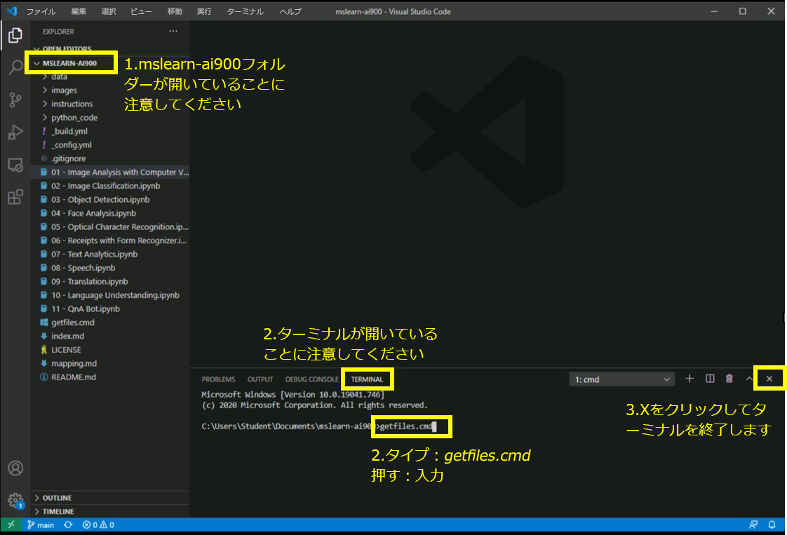

# AI-900 ラボ
## Visual Studio Code を使用する

1.  Visual Studio Code を起動します。プログラムのアイコンは下部のタスクバーに固定されています。開くと、左側のパネルに MSLEARN-AI900 プロジェクトが表示されます。
2.  最新バージョンのプロジェクトをプルします。開いているターミナルで +++getfiles.cmd+++ と入力し、**Enter** を押します。このコマンドを使用すると、最新バージョンのプロジェクトがフォルダーにプルされます。 
3.  コマンドを実行したら、ターミナル パネルを閉じても構いません。これでラボの準備が整いました。 

